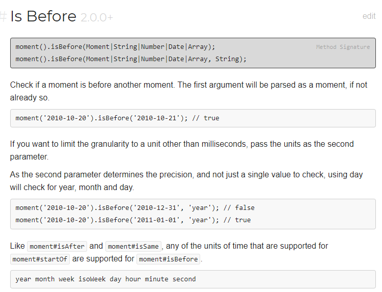

## Saving entered todos

Objects are key-value pairs
localStorage is an object
https://blog.logrocket.com/localstorage-javascript-complete-guide/

We only have 2 things to worry about actually storing locally, the time and the to-do text
so I dont think we need to put them in an array. 

localStorage can look like this initially: 

{
9am: ""
10am: ""
11am: ""
12pm: ""
1pm: ""
2pm: ""
3pm: ""
4pm: ""
5pm: ""
6pm: ""
7pm: ""
8pm: ""
9pm: ""
10pm: ""
11pm: ""
12pm: ""
}

that's 16 key-value pairs. We could just initialize it 

The values can be retrieved with getItem(key) 

key(i) returns the KEY based on the index. key(1), key(2), key(3) would be 9am, 10am 11am. 

1 9am: 
2 10am: 
3 11am: 
4 12pm: 
5 1pm: 
6 2pm: 
7 3pm: 
8 4pm:
9 5pm: 
10 6pm: 
11 7pm: 
12 8pm: 
13 9pm: 
14 10pm: 
15 11pm: 
16 12pm: 

key(1), key(2), key(3) would be 9am, 10am 11am and would each return whatever the value was. "pick up groceries" or whatever.   

getItem() accepts a key and returns the value as a string
setItem() accepts 2 arguments, a key and value. so we can setItem ("9am", userInput.value) - if we define userInput as a global variable. We'd query select the form input in this case.

moment can reformat that time into whatever format we want with something like moment("9am", "ha").format("whatever") if we need to. 

## Coloring the columns

moment().isBefore and moment().isAfter checks if one moment is before or after another. there's also isSame()
https://momentjs.com/docs/#/query/is-before/

To get the current hour i think we would declare this globally:

var thisHour = moment().format("ha")

then I THINK we can just do:

moment(thisHour).isBefore(localStorage.key(i)) 

might have to format the key first but I don't think so since key() returns a string anyhow. 

If it's 10pm now and we did key(4) - which would be 9am, it would return FALSE

if it's 1030am and we did did moment(thisHour).isSame(localStorage.key(2)) it would return as TRUE

if we were doing this box by box, 
we'd need 3 if else statements

if(the time in this column is in the future){
    change class of the this column to green
} else if (the time in this column is in the past) {
    change class of this column to grey
} else {
    change class of appropriate column to red
}

* Think we'd need to put that in a for loop that retrieves the current hour in that row. 

I can't think of an easy way to do this aside from assigning a unique id to each row. we can navigate the columns within the rows with DOM stuff. 

The logic would go through each box one by one changing the colors 

## Putting current time in subheader
declare a variable jumboTime querying the subheader 
then use jumboTime.textContent = moment().format("dddd, MMMM Do)

## tips
when click function is fired read text 
